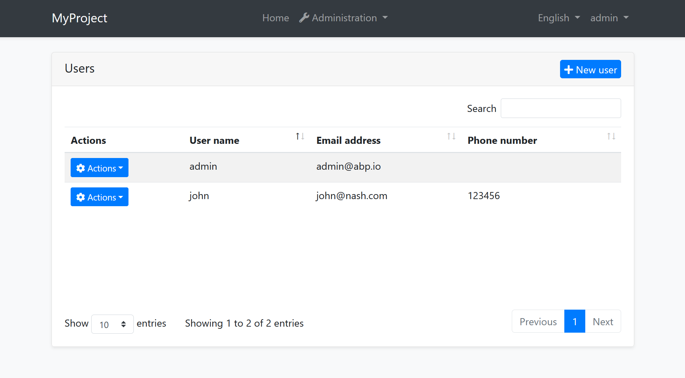

# Angular UI: Basic Theme

The Basic Theme is a theme implementation for the Angular UI. It is a minimalist theme that doesn't add any styling on top of the plain [Bootstrap](https://getbootstrap.com/). You can take the Basic Theme as the **base theme** and build your own theme or styling on top of it. See the *Customization* section.

> If you are looking for a professional, enterprise ready theme, you can check the [Lepton Theme](https://commercial.abp.io/themes), which is a part of the [ABP](https://commercial.abp.io/).

> See the [Theming document](theming.md) to learn about themes.

## Installation

If you need to manually this theme, follow the steps below:

* Install the [@abp/ng.theme.basic](https://www.npmjs.com/package/@abp/ng.theme.basic) NPM package to your Angular project.
* Open the `src/app/app.module.ts` file, import `ThemeBasicModule` (it can be imported from `@abp/ng.theme.basic` package), and add `ThemeBasicModule.forRoot()` to the `imports` array.
* Open the `src/app/shared/shared.module` file, import `ThemeBasicModule` (it can be imported from `@abp/ng.theme.basic` package), and add `ThemeBasicModule` to the `imports` and `exports` array.

The `ThemeBasicModule` is registered own layouts (`ApplicationLayoutComponent`, `AccountLayoutComponent`, `EmptyLayoutComponent`) to a service which is exposed by `@abp/ng.core` package on application initialization. 

## Application Layout



Application Layout implements the following parts, in addition to the common parts mentioned above;

* Logo area
* Routes area
* Language selection & user menu
* [Page Alerts](page-alerts.md)

See Application Layout components:


### How to Use a Layout

Routes should be added to the menu by calling `add` method `RoutesService`. A layout can be set in the object of your route. See the [modifying the menu](Modifying-the-Menu#how-to-add-a-navigation-element) for more information.

## Customization

You have two options two customize this theme:

### Overriding Styles / Components

In this approach, you continue to use the theme as an NPM package and customize the parts you need to. There are several ways to customize it;

#### Override the Styles

You can simply override the styles in the global styles (`src/styles.scss`) file of your application.

#### Override the Components

See the [Component Replacement](component-replacement.md) to learn how you can replace components, customize and extend the user interface.

### Copy & Customize

You can run the following [ABP CLI](../../../cli) command in **Angular** project directory to copy the source code to your solution:

`abp add-package @abp/ng.theme.basic --with-source-code`

----

Or, you can download the [source code](https://github.com/abpframework/abp/blob/dev/npm/ng-packs/packages/theme-basic) of the Basic Theme, manually copy the project content into your project (`projects/theme-basic` folder), open `angular.json` file and add configuration below to the `projects` object:

```json
{
    "projects": {
        ...
        "theme-basic": {
            "projectType": "library",
            "root": "projects/theme-basic",
            "sourceRoot": "projects/theme-basic/src",
            "prefix": "abp",
            "architect": {
                "build": {
                    "builder": "@angular-devkit/build-angular:ng-packagr",
                    "options": {
                        "tsConfig": "projects/theme-basic/tsconfig.lib.json",
                        "project": "projects/theme-basic/ng-package.json"
                    },
                    "configurations": {
                        "production": {
                        "tsConfig": "projects/theme-basic/tsconfig.lib.prod.json"
                        }
                    }
                }
            }
        }
    }
}
```

Then, open the `tsconfig.json` file and add new paths as follows:

```json
"paths": {
    ...
    "@abp/ng.theme.basic": ["projects/theme-basic/src/public-api.ts"],
    "@abp/ng.theme.basic/testing": ["projects/theme-basic/testing/src/public-api.ts"]
}
```


You can now freely customize the theme based on your application requirements.

## See Also

* [Theming](theming.md)
