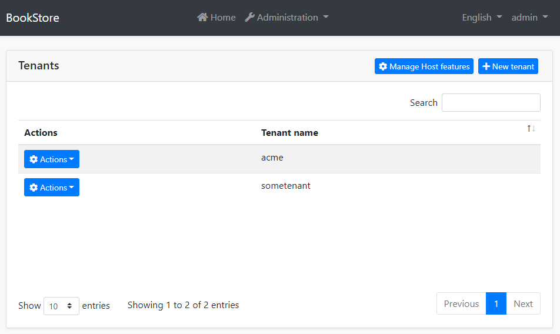
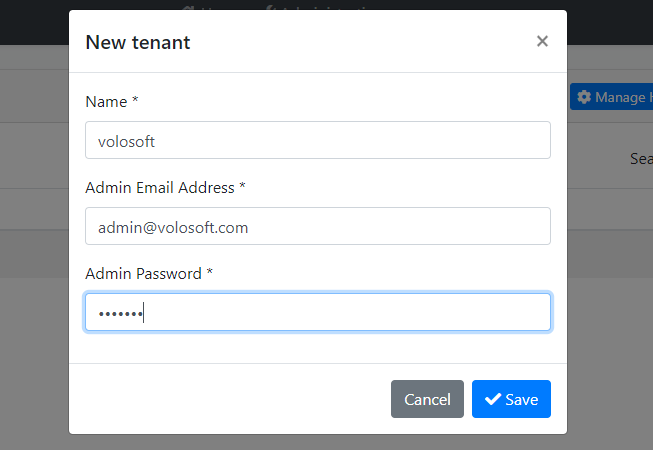
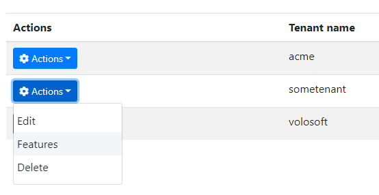

# Tenant Management Module

[Multi-Tenancy](../framework/architecture/multi-tenancy) is one of the core features of ABP. It provides the fundamental infrastructure to build your own SaaS (Software-as-a-Service) solution. ABP's multi-tenancy system abstracts where your tenants are stored, by providing the `ITenantStore` interface. All you need to do is to implement that interface.

**The Tenant Management module is an implementation of the the `ITenantStore` interface. It stores tenants in a database. It also provides UI to manage your tenants and their [features](../framework/infrastructure/features.md).**

> Please **refer to the [Multi-Tenancy](../framework/architecture/multi-tenancy) documentation** to understand the multi-tenancy system of the ABP. This document focuses on the Tenant Management module.

### About the ABP SaaS Module

The [SaaS Module](https://commercial.abp.io/modules/Volo.Saas) is an alternative implementation of this module with more features and possibilities. It is distributed as a part of the [ABP](https://commercial.abp.io/) subscription.

## How to Install

This module comes as pre-installed (as NuGet/NPM packages) when you [create a new solution](https://abp.io/get-started) with the ABP. You can continue to use it as package and get updates easily, or you can include its source code into your solution (see `get-source` [CLI](../cli) command) to develop your custom module.

### The Source Code

The source code of this module can be accessed [here](https://github.com/abpframework/abp/tree/dev/modules/tenant-management). The source code is licensed with [MIT](https://choosealicense.com/licenses/mit/), so you can freely use and customize it.

## User Interface

This module adds "*Administration -> Tenant Management -> Tenants*" menu item to the main menu of the application, which opens the page shown below:



In this page, you see the all the tenants. You can create a new tenant as shown below:



In this modal;

* **Name**: The unique name of the tenant. If you use subdomains for your tenants (like https://some-tenant.your-domain.com), this will be the subdomain name.
* **Admin Email Address**: Email address of the admin user for this tenant.
* **Admin Password**: The password of the admin user for this tenant.

When you click to *Actions* button near to a tenant, you will see the actions you can take:



### Managing the Tenant Features

The Features action opens a modal to enable/disable/set [features](../framework/infrastructure/features.md) for the related tenant. Here, an example modal:


### Managing the Host Features

*Manage Host features* button is used  to set features for the host side, if you use the features of your application also in the host side.

## Distributed Events

This module defines the following ETOs (Event Transfer Objects) to allow you to subscribe to changes on the entities of the module;

- `TenantEto` is published on changes done on an `Tenant` entity.

**Example: Get notified when a new tenant has been created**

```cs
public class MyHandler :
    IDistributedEventHandler<EntityCreatedEto<TenantEto>>,
    ITransientDependency
{
    public async Task HandleEventAsync(EntityCreatedEto<TenantEto> eventData)
    {
        TenantEto tenant = eventData.Entity;
        // TODO: ...
    }
}
```


`TenantEto` is configured to automatically publish the events. You should configure yourself for the others. See the [Distributed Event Bus document](https://github.com/abpframework/abp/blob/rel-7.3/docs/en/Distributed-Event-Bus.md) to learn details of the pre-defined events.

> Subscribing to the distributed events is especially useful for distributed scenarios (like microservice architecture). If you are building a monolithic application, or listening events in the same process that runs the Tenant Management Module, then subscribing to the [local events](https://github.com/abpframework/abp/blob/rel-7.3/docs/en/Local-Event-Bus.md) can be more efficient and easier.

## Internals

This section can be used as a reference if you want to [customize](../framework/architecture/modularity/extending/customizing-application-modules-guide.md) this module without changing [its source code](https://github.com/abpframework/abp/tree/dev/modules/tenant-management).

### Domain Layer

#### Aggregates

* `Tenant`

#### Repositories

* `ITenantRepository`

#### Domain Services

* `TenantManager`

### Application Layer

#### Application Services

* `TenantAppService`

#### Permissions

- `AbpTenantManagement.Tenants`: Tenant management.
- `AbpTenantManagement.Tenants.Create`: Creating a new tenant.
- `AbpTenantManagement.Tenants.Update`: Editing an existing tenant.
- `AbpTenantManagement.Tenants.Delete`: Deleting an existing tenant.
- `AbpTenantManagement.Tenants.ManageFeatures`: Manage features of the tenants.

### Entity Framework Core Integration

* `TenantManagementDbContext` (implements `ITenantManagementDbContext`)

**Database Tables:**

* `AbpTenants`
* `AbpTenantConnectionStrings`

### MongoDB Integration

* `TenantManagementMongoDbContext` (implements `ITenantManagementMongoDbContext`)

**Database Collections:**

* `AbpTenants` (also includes the connection string)

## Notices

ABP allows to use *database per tenant* approach that allows a tenant can have a dedicated database. This module has the fundamental infrastructure to make that implementation possible (see its source code), however it doesn't implement the application layer and UI functionalities to provide it as an out of the box implementation. You can implement these features yourself, or consider to use the [ABP Saas Module](./saas.md) that fully implements it and provides much more business features.

## See Also

* [Multi-Tenancy](../framework/architecture/multi-tenancy)
* [ABP SaaS Module](./saas.md)
