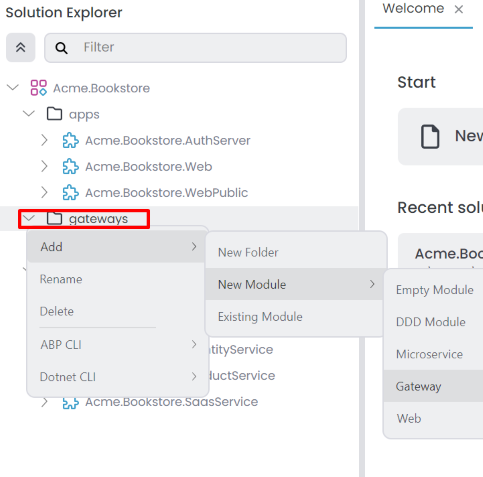

# Microservice Solution: Adding New API Gateways

API gateways are the entry points of your microservice system. They are responsible for routing the incoming requests to the correct microservices. In a microservice system, you can have multiple API gateways to serve different purposes. For example, you can have a public API gateway for your customers and a private API gateway for your internal services. In the solution template, there is a folder named `gateways` that includes the API gateway projects. You can add new API gateways to this folder.

Additionally, there is a folder named `_templates` in the root directory. This folder contains templates you can use to create new microservices, API gateways, and applications. These templates can be customized according to your needs.

## Adding a New API Gateway

To add a new gateway application to the solution, you can use the `gateway` template. This template creates a new ASP.NET Core application with the necessary configurations and dependencies. Follow the steps below to add a new web application:

In ABP Studio [Solution Explorer](../../studio/solution-explorer.md#adding-a-new-microservice-module), right-click on the `gateways` folder and select `Add` -> `New Module` -> `Gateway`.



It opens the `Create New Module` dialog. Enter the name of the new application, specify the output directory if needed, and click the `Create` button. There is a naming convention: the *Module name* should include the solution name as a prefix, and the use of the dot (.) character in the *Module name* is not allowed.


The new gateway is created and added to the solution. You can see the new application in the `gateways` folder.


### Configuring the appsettings.json

The new gateway application is use the [YARP](https://microsoft.github.io/reverse-proxy/) as a reverse proxy. You can configure the `appsettings.json` file to define the routes and endpoints. The `ReverseProxy` section in the `appsettings.json` file includes the configuration for the reverse proxy. You can add new routes and endpoints to this section.

```json
{
  "ReverseProxy": {
    "Routes": {
      "AbpApi": {
        "ClusterId": "Administration",
        "Match": {
          "Path": "/api/abp/{**catch-all}"
        }
      },
      "AdministrationSwagger": {
        "ClusterId": "Administration",
        "Match": {
          "Path": "/swagger-json/Administration/swagger/v1/swagger.json"
        },
        "Transforms": [
          { "PathRemovePrefix": "/swagger-json/Administration" }
        ]
      },
      "ProductService": {
        "ClusterId": "ProductService",
        "Match": {
          "Path": "/api/productservice/{**catch-all}"
        }
      },
      "ProductServiceSwagger": {
        "ClusterId": "ProductService",
        "Match": {
          "Path": "/swagger-json/ProductService/swagger/v1/swagger.json"
        },
        "Transforms": [
          { "PathRemovePrefix": "/swagger-json/ProductService" }
        ]
      }
    },
    "Clusters": {
      "Administration": {
        "Destinations": {
          "Administration": {
            "Address": "http://localhost:44393/"
          }
        }
      },
      "ProductService": {
        "Destinations": {
          "ProductService": {
            "Address": "http://localhost:44350/"
          }
        }
      }
    }
  }
}
```

### Configuring the OpenId Options

We should configure the OpenId options by modifying the `OpenIddictDataSeeder` in the `Identity` service. Below is an example of the `OpenIddictDataSeeder` options for the `PublicWeb` gateway.

Add the created gateway URL to the *redirectUris* parameter in the `CreateSwaggerClientAsync` method in the `OpenIddictDataSeeder` class.

```csharp
private async Task CreateSwaggerClientAsync(string clientId, string[] scopes)
{
    var webGatewaySwaggerRootUrl = _configuration["OpenIddict:Applications:WebGateway:RootUrl"]!.TrimEnd('/'); 
    //PublicWebGateway uri
    var publicWebGatewaySwaggerRootUrl = _configuration["OpenIddict:Applications:PublicWebGateway:RootUrl"]!.TrimEnd('/');
    ...

    await CreateOrUpdateApplicationAsync(
        name: clientId,
        type:  OpenIddictConstants.ClientTypes.Public,
        consentType: OpenIddictConstants.ConsentTypes.Implicit,
        displayName: "Swagger Test Client",
        secret: null,
        grantTypes: new List<string>
        {
            OpenIddictConstants.GrantTypes.AuthorizationCode,
        },
        scopes: commonScopes.Union(scopes).ToList(),
        redirectUris: new List<string> {
            $"{webGatewaySwaggerRootUrl}/swagger/oauth2-redirect.html",
            $"{publicWebGatewaySwaggerRootUrl}/swagger/oauth2-redirect.html", // PublicWebGateway redirect uri
            ...
        },
        clientUri: webGatewaySwaggerRootUrl,
        logoUri: "/images/clients/swagger.svg"
    );
}
```

Add the new gateway URL to the `appsettings.json` file in the `Identity` service.

```json
{
  "OpenIddict": {
    "Applications": {
      ...
      "PublicWebGateway": {
        "RootUrl": "http://localhost:44355"
      }
    }
  }
}
```

### Configuring the AuthServer

We should configure the AuthServer for **CORS** and **RedirectAllowedUrls**.

```json
"App": {
  "SelfUrl": "http://localhost:***",
  "CorsOrigins": "...... ,http://localhost:44355",
  "EnablePII": false,
  "RedirectAllowedUrls": "...... ,http://localhost:44355"
}
```

### Add the New Gateway to the Solution Runner
