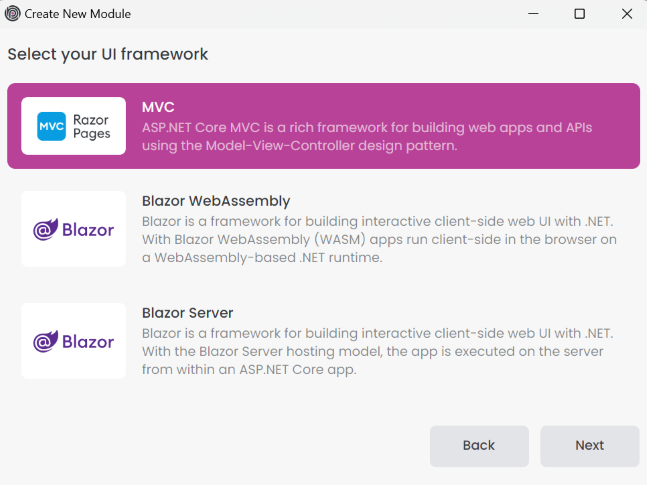
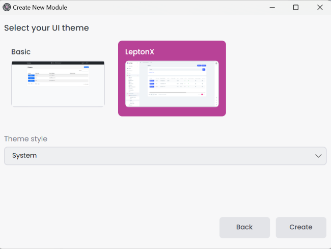
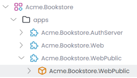

# Microservice Solution: Adding New Applications

You can add new applications to the microservice solution template. This document explains how to add new web applications to the solution. In the solution template, there is a folder named `apps` in the root directory, which contains all the applications in the solution. You can create separate applications for different purposes, such as web applications, public websites for landing pages, or admin panels.

Additionally, there is a folder named `_templates` in the root directory. This folder contains templates you can use to create new microservices, API gateways, and applications. These templates can be customized according to your needs.

## Adding a New Web Application

To add a new web application to the solution, you can use the `web` template. This template creates a new ASP.NET Core application with the necessary configurations and dependencies. Follow the steps below to add a new web application:

In ABP Studio [Solution Explorer](../../studio/solution-explorer.md#adding-a-new-microservice-module), right-click on the `apps` folder and select `Add` -> `New Module` -> `Web`.

It opens the `Create New Module` dialog. Enter the name of the new application, specify the output directory if needed, and click the `Next` button. There is a naming convention: the *Module name* should include the solution name as a prefix, and the use of the dot (.) character in the *Module name* is not allowed.

Select the UI framework and click the `Next` button.

Select the UI theme and click the `Create` button.

The new application is created and added to the solution. You can see the new microservice in the `apps` folder.

