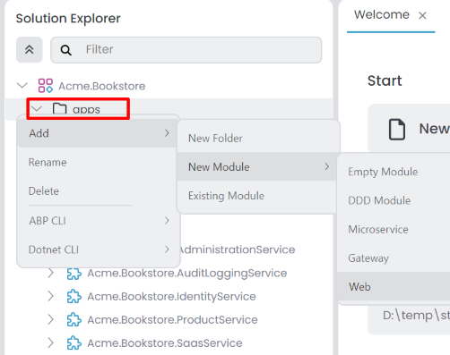
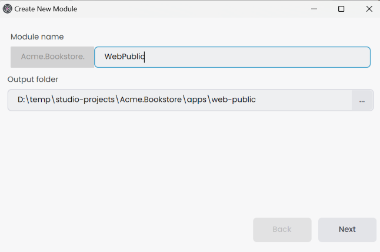
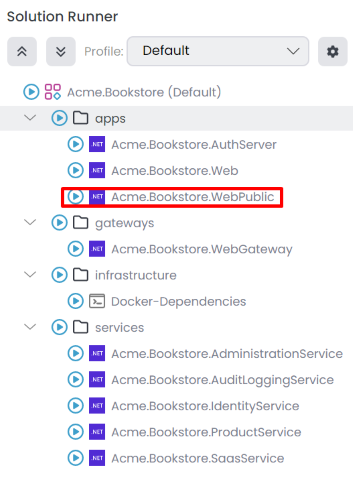

# Microservice Solution: Adding New Applications

You can add new applications to the microservice solution template. This document explains how to add new web applications to the solution. In the solution template, there is a folder named `apps` in the root directory, which contains all the applications in the solution. You can create separate applications for different purposes, such as web applications, public websites for landing pages, or admin panels.

Additionally, there is a folder named `_templates` in the root directory. This folder contains templates you can use to create new microservices, API gateways, and applications. These templates can be customized according to your needs.

## Adding a New Web Application

To add a new web application to the solution, you can use the `web` template. This template creates a new ASP.NET Core application with the necessary configurations and dependencies. Follow the steps below to add a new web application:

In ABP Studio [Solution Explorer](../../studio/solution-explorer.md#adding-a-new-microservice-module), right-click on the `apps` folder and select `Add` -> `New Module` -> `Web`.



It opens the `Create New Module` dialog. Enter the name of the new application, specify the output directory if needed, and click the `Next` button. There is a naming convention: the *Module name* should include the solution name as a prefix, and the use of the dot (.) character in the *Module name* is not allowed.



Select the UI framework and click the `Next` button.


Select the UI theme and click the `Create` button.


The new application is created and added to the solution. You can see the new microservice in the `apps` folder.


### Configuring the appsettings.json

The new application is created with the necessary configurations and dependencies. We should configure the `appsettings.json` file to set the Authority section for the authentication and Gateway section for the API gateway. The `Authority` section is the URL of the Identity Server, and the `Gateway` section is the URL of the API gateway. You can copy the configurations from the existing web application and modify them according to the new application. Below is an example of the `appsettings.json` file for the `Public` web application.

```json
{
  "App": {
    "SelfUrl": "http://localhost:44344",
    "EnablePII": false
  },
  "AuthServer": {
    "Authority": "http://localhost:44387",
    "RequireHttpsMetadata": "false",
    "ClientId": "WebPublic",
    "ClientSecret": "1q2w3e*",
    "IsOnK8s": "false",
    "MetaAddress": "http://localhost:44387"
  },
  "RemoteServices": {
    "Default": {
      "BaseUrl": "http://localhost:44333"
    }
  },
  ...
}
```

### Configuring the OpenId Options

You can use existing [openiddict applications](../../modules/openiddict.md#openiddictapplication] or create a new one for the new web application. In our example we use *WebPublic* as the `ClientId` and *1q2w3e\** as the `ClientSecret`. According to the configurations in the `appsettings.json` file, we should configure the `OpenIddictDataSeeder` in the `Identity` service. You can copy the configurations from the existing web application and modify them according to the new application. Below is an example of the `OpenIddictDataSeeder` configuration for the `Public` web application.

```csharp
private async Task CreateClientsAsync()
{
    ...

    //Web Public Client
    var webPublicClientRootUrl = _configuration["OpenIddict:Applications:WebPublic:RootUrl"]!.EnsureEndsWith('/');
    await CreateOrUpdateApplicationAsync(
        name: "WebPublic",
        type: OpenIddictConstants.ClientTypes.Confidential,
        consentType: OpenIddictConstants.ConsentTypes.Implicit,
        displayName: "Web Public Client",
        secret: "1q2w3e*",
        grantTypes: new List<string> //Hybrid flow
        {
            OpenIddictConstants.GrantTypes.AuthorizationCode,
            OpenIddictConstants.GrantTypes.Implicit
        },
        scopes: commonScopes.Union(new[]
        {
            "AuthServer", 
            "IdentityService",
            "SaasService",
            "AuditLoggingService",
            "AdministrationService"
        }).ToList(),
        redirectUris: new List<string> { $"{webPublicClientRootUrl}signin-oidc" },
        postLogoutRedirectUris: new List<string>() { $"{webPublicClientRootUrl}signout-callback-oidc" },
        clientUri: webPublicClientRootUrl,
        logoUri: "/images/clients/aspnetcore.svg"
    );
}
```

Add the new application URL to the `appsettings.json` file in the `Identity` service.

```json
{
  "OpenIddict": {
    "Applications": {
      ...
      "WebPublic": {
        "RootUrl": "http://localhost:44344"
      }
    }
  }
}
```

### Configuring the AuthServer

We should configure the AuthServer for **CORS** and **RedirectAllowedUrls**.

```json
"App": {
  "SelfUrl": "http://localhost:***",
  "CorsOrigins": "...... ,http://localhost:44344",
  "EnablePII": false,
  "RedirectAllowedUrls": "...... ,http://localhost:44344"
}
```

### Add the New Application to the Solution Runner

We should add the new application to the solution runner [profile](../../studio/running-applications.md#profile) for running applications in the ABP Studio. You can follow the steps explained in the [Solution Runner](../../studio/running-applications.md#c-application) document to add the new application to the solution runner profile. Afterwards, you can start the new application by selecting it in the solution runner.



## Docker Configuration for Prometheus

If you want to monitor the new application with Prometheus when you debug the solution, you should add the new application to the `prometheus.yml` file in the `etc/docker/prometheus` folder. You can copy the configurations from the existing microservices and modify them according to the new application. Below is an example of the `prometheus.yml` file for the `WebPublic` application.

```yml
  - job_name: 'webpublic'
    scheme: http
    metrics_path: 'metrics'
    static_configs:
    - targets: ['host.docker.internal:44344']
```

## Creating Helm Chart for the New Microservice