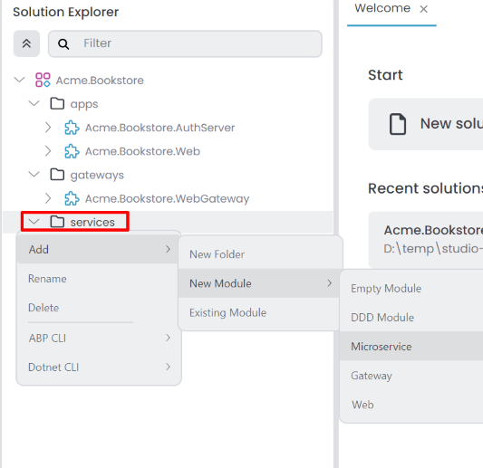
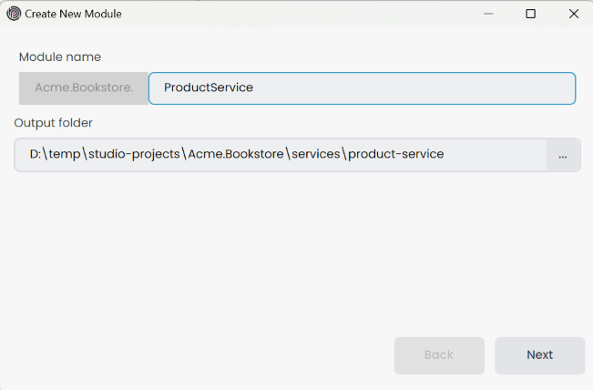
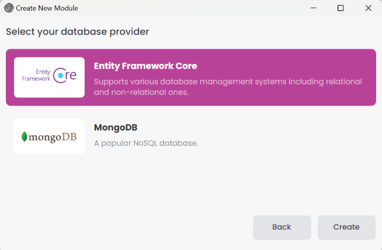

# Microservice Solution: Adding New Microservices

This document explains how to add new microservices to the microservice solution template. In the microservice solution template, there is a folder named `services` in the root directory. This folder contains all the microservices in the solution. Each microservice is a separate ASP.NET Core application and can be developed, tested, and deployed independently. There is also a folder named `_templates` in the root directory. There are some templates in this folder that you can use to create new microservices, API gateways, and applications. You can customize these templates if you need to.

## Adding a New Microservice

To add a new microservice to the solution, you can use the `service_nolayers` template. This template creates a new ASP.NET Core application with the necessary configurations and dependencies. Follow the steps below to add a new microservice:

In ABP Studio [Solution Explorer](../../studio/solution-explorer.md#adding-a-new-microservice-module), right-click on the `services` folder and select `Add` -> `New Module` -> `Microservice`.

It opens the `Create New Module` dialog. Enter the name of the new microservice, you can specify the output directory, and click the `Next` button.

Select the database provider and click the `Create` button.

The new microservice is created and added to the solution. You can see the new microservice in the `services` folder.

