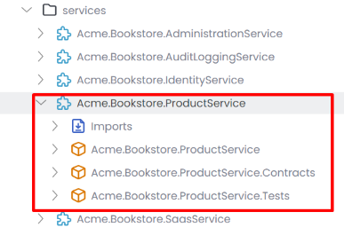
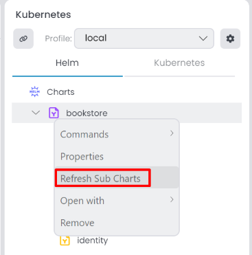
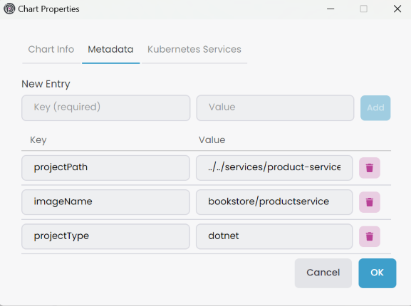
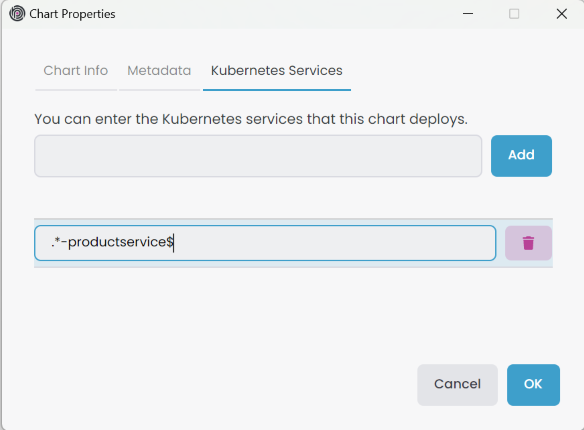

# Microservice Solution: Adding New Microservices

This document explains how to add new microservices to the microservice solution template. In the microservice solution template, there is a folder named `services` in the root directory. This folder contains all the microservices in the solution. Each microservice is a separate ASP.NET Core application and can be developed, tested, and deployed independently. There is also a folder named `_templates` in the root directory. There are some templates in this folder that you can use to create new microservices, API gateways, and applications. You can customize these templates if you need to.

## Adding a New Microservice

To add a new microservice to the solution, you can use the `service_nolayers` template. This template creates a new ASP.NET Core application with the necessary configurations and dependencies. Follow the steps below to add a new microservice:

In ABP Studio [Solution Explorer](../../studio/solution-explorer.md#adding-a-new-microservice-module), right-click on the `services` folder and select `Add` -> `New Module` -> `Microservice`.


It opens the `Create New Module` dialog. Enter the name of the new microservice, you can specify the output directory, and click the `Next` button. There is a name convention the *Module name* includes the solution name as a prefix, and the use of the dot(.) character in the *Module name* is not allowed.


Select the database provider and click the `Create` button.


The new microservice is created and added to the solution. You can see the new microservice in the `services` folder.



### Configuring the appsettings.json

The new microservice is created with the necessary configurations and dependencies.We should configure the several sections by modifying the `appsettings.json` file. 
 * We should set the `Administration` & `AbpBlobStoring` connection strings.
 * We should set the correct `StringEncryption` key.
 * We should set the `CorsOrigins` to allow the web gateway to access the microservice.
 * We should set the `AuthServer` configurations to enable the microservice to authenticate and authorize the users.

You can copy the configurations from the existing microservices and modify them according to the new microservice. Below is an example of the `appsettings.json` file for the `ProductService` microservice.

```json
{
  "ConnectionStrings": {
    "Administration": "Server=localhost,1434; User Id=sa; Password=myPassw@rd; Database=Bookstore_Administration; TrustServerCertificate=true",
    "AbpBlobStoring": "Server=localhost,1434; User Id=sa; Password=myPassw@rd; Database=Bookstore_BlobStoring; TrustServerCertificate=true",
    "ProductService": "Server=localhost,1434; User Id=sa; Password=myPassw@rd; Database=Bookstore_ProductService; TrustServerCertificate=true"
  },
  "App": {
    "CorsOrigins": "http://localhost:44333",
    "EnablePII": false
  },
  "Swagger": {
    "IsEnabled": true
  },
  "AuthServer": {
    "Authority": "http://localhost:44387",
    "MetaAddress": "http://localhost:44387",
    "RequireHttpsMetadata": "false",
    "SwaggerClientId": "SwaggerTestUI",
    "Audience": "ProductService"
  },
  "Redis": {
    "Configuration": "localhost:6379"
  },
  "RabbitMQ": {
    "Connections": {
      "Default": {
        "HostName": "localhost"
      }
    },
    "EventBus": {
      "ClientName": "Bookstore_ProductService",
      "ExchangeName": "Bookstore"
    }
  },
  "AbpDistributedCache": {
    "KeyPrefix": "Bookstore:"
  },
  "DataProtection": {
    "ApplicationName": "Bookstore",
    "Keys": "Bookstore-Protection-Keys"
  },
  "ElasticSearch": {
    "IsLoggingEnabled": "true",
    "Url": "http://localhost:9200"
  },
  "StringEncryption": {
    "DefaultPassPhrase": "PDAWjbshpwlOwNB6"
  }
}
```

### Configuring the OpenId Options

We should configure the OpenId options by modifying the `OpenIddictDataSeeder` in the `Identity` service. Below is an example of the `OpenIddictDataSeeder` options for the `ProductService` microservice.

Create API scopes and add the requested API scope for swagger clients in the `CreateApiScopesAsync` and `CreateSwaggerClientsAsync` methods in the `OpenIddictDataSeeder` class.

```csharp
private async Task CreateApiScopesAsync()
{
    await CreateScopesAsync("AuthServer");
    await CreateScopesAsync("IdentityService");
    await CreateScopesAsync("AdministrationService");
    await CreateScopesAsync("ProductService"); // new service
}

private async Task CreateSwaggerClientsAsync()
{
    await CreateSwaggerClientAsync("SwaggerTestUI", new[]
    {
        "AuthServer",
        "IdentityService",
        "AdministrationService",
        "ProductService" // new service
    });
}
```

Add redirect URL for the new service in the `CreateSwaggerClientAsync` method.

```csharp
private async Task CreateSwaggerClientAsync(string clientId, string[] scopes)
{
    ...
    ...
    ...
    var administrationServiceRootUrl = _configuration["OpenIddict:Resources:AdministrationService:RootUrl"]!.TrimEnd('/');
    var productServiceServiceRootUrl = _configuration["OpenIddict:Resources:ProductService:RootUrl"]!.TrimEnd('/'); // new service

    await CreateOrUpdateApplicationAsync(
        name: clientId,
        type:  OpenIddictConstants.ClientTypes.Public,
        consentType: OpenIddictConstants.ConsentTypes.Implicit,
        displayName: "Swagger Test Client",
        secret: null,
        grantTypes: new List<string>
        {
            OpenIddictConstants.GrantTypes.AuthorizationCode,
        },
        scopes: commonScopes.Union(scopes).ToList(),
        redirectUris: new List<string> {
            $"{webGatewaySwaggerRootUrl}/swagger/oauth2-redirect.html",
            $"{authServerRootUrl}/swagger/oauth2-redirect.html",
            $"{identityServiceRootUrl}/swagger/oauth2-redirect.html",
            $"{administrationServiceRootUrl}/swagger/oauth2-redirect.html",
            $"{productServiceServiceRootUrl}/swagger/oauth2-redirect.html", // new service
        }
    );
}
```

Add allowed scope for the web (front-end) application(s) in the `CreateClientsAsync` method. You might have different clients for different UI applications such as web, angular, react, etc. You should add the new service to the allowed scopes of the clients.

```csharp
private async Task CreateClientsAsync()
{
    var commonScopes = new List<string>
    {
        OpenIddictConstants.Permissions.Scopes.Address,
        OpenIddictConstants.Permissions.Scopes.Email,
        OpenIddictConstants.Permissions.Scopes.Phone,
        OpenIddictConstants.Permissions.Scopes.Profile,
        OpenIddictConstants.Permissions.Scopes.Roles
    };

    //Web Client
    var webClientRootUrl = _configuration["OpenIddict:Applications:Web:RootUrl"]!.EnsureEndsWith('/');
    await CreateOrUpdateApplicationAsync(
        name: "Web",
        type: OpenIddictConstants.ClientTypes.Confidential,
        consentType: OpenIddictConstants.ConsentTypes.Implicit,
        displayName: "Web Client",
        secret: "1q2w3e*",
        grantTypes: new List<string>
        {
            OpenIddictConstants.GrantTypes.AuthorizationCode,
            OpenIddictConstants.GrantTypes.Implicit
        },
        scopes: commonScopes.Union(new[]
        {
            "AuthServer", 
            "IdentityService",
            "SaasService",
            "AuditLoggingService",
            "AdministrationService",
            "ProductService" // new service
        }).ToList(),
        redirectUris: new List<string> { $"{webClientRootUrl}signin-oidc" },
        postLogoutRedirectUris: new List<string>() { $"{webClientRootUrl}signout-callback-oidc" },
        clientUri: webClientRootUrl,
        logoUri: "/images/clients/aspnetcore.svg"
    );
}
```

Add the new service URL to the `appsettings.json` file in the `Identity` service.

```json
"OpenIddict": {
  "Applications": {
    ...
  },
  "Resources": {
    ...
    "ProductService": {
      "RootUrl": "http://localhost:44350"
    }
  }
}
```


### Configuring the AuthServer

We should configure the AuthServer for *CORS* and *RedirectAllowedUrls*.

```json
"App": {
  "SelfUrl": "http://localhost:***",
  "CorsOrigins": "...... ,http://localhost:44350",
  "EnablePII": false,
  "RedirectAllowedUrls": "...... ,http://localhost:44350"
}
```

### Configuring the API Gateway

We should configure the API Gateway to allow the web gateway to access the new microservice. First, we should add the *ProductService* sections to the `appsettings.json` file in the `WebGateway` service.

```json
"ReverseProxy": {
    "Routes": {
      ...
      "ProductService": {
        "ClusterId": "ProductService",
        "Match": {
          "Path": "/api/productservice/{**catch-all}"
        }
      },
      "ProductServiceSwagger": {
        "ClusterId": "ProductService",
        "Match": {
          "Path": "/swagger-json/ProductService/swagger/v1/swagger.json"
        },
        "Transforms": [
          { "PathRemovePrefix": "/swagger-json/ProductService" }
        ]
      }
    },
    "Clusters": {
      ...
      "ProductService": {
        "Destinations": {
          "ProductService": {
            "Address": "http://localhost:44350/"
          }
        }
      }
    }
}
```

Afterwards open the `ProjectNameWebGatewayModule` class in the `WebGateway` service and add the `ProductService` to the `ConfigureSwaggerUI` method.

```csharp
options.OAuthScopes(
    "AdministrationService",
    "AuthServer",
    "IdentityService",
    "ProductService" // new service
);
```

### Configuring the UI Services

We should configure the UI application(s) to allow the new microservice to access through the web gateway. To do this, we should add the new service scope to the `ConfigureAuthentication` method in the `ProjectNameWebModule` class in the `Web` or `Blazor` application.

```csharp
context.Services.AddAuthentication(options =>
{
	options.DefaultScheme = "Cookies";
	options.DefaultChallengeScheme = "oidc";
})
.AddCookie("Cookies", options =>
{
	options.ExpireTimeSpan = TimeSpan.FromDays(365);
})
.AddAbpOpenIdConnect("oidc", options =>
{
	...
	options.Scope.Add("AuthServer");
	options.Scope.Add("IdentityService");
	options.Scope.Add("AdministrationService");
	options.Scope.Add("ProductService"); // new servie
});
```

Similarly, if you have a Angular application, you should add the new service scope to the oAuthConfig in `envrionment.ts`:

```typescript
const baseUrl = 'http://localhost:4200';

const oAuthConfig = {
  issuer: 'http://localhost:44387',
  redirectUri: baseUrl,
  clientId: 'Angular',
  responseType: 'code',
  scope: 'openid profile email roles AuthServer IdentityService AdministrationService ProductService', // new service
  requireHttps: false
};
```

### Add the New Microservice to the Solutin Runner

We should add the new microservice to the solution runner [profile](../../studio/running-applications.md#profile) for running application in the ABP Studio. You can follow the steps explained in the [Solution Runner](../../studio/running-applications.md#c-application) document to add the new microservice to the solution runner profile. Afterwards you can start the new microservice by selecting the new microservice in the solution runner.


## Docker Configuration for Prometheus

If you want to monitor the new microservice with Prometheus when you debug the solution, you should add the new microservice to the `prometheus.yml` file in the `etc/docker/prometheus` folder. You can copy the configurations from the existing microservices and modify them according to the new microservice. Below is an example of the `prometheus.yml` file for the `ProductService` microservice.

```yml
  - job_name: 'product'
    scheme: http
    metrics_path: 'metrics'
    static_configs:
    - targets: ['host.docker.internal:44350']
```

## Creating Helm Chart for the New Microservice

If you want to deploy the new microservice to Kubernetes, you should create a Helm chart for the new microservice. 

First, we need to add the new microservice to the `build-all-images.ps1` script in the `etc/helm` folder. You can copy the configurations from the existing microservices and modify them according to the new microservice. Below is an example of the `build-all-images.ps1` script for the `ProductService` microservice.

```powershell
./build-image.ps1 -ProjectPath "../../services/administration/Acme.Bookstore.AdministrationService/Acme.Bookstore.AdministrationService.csproj" -ImageName bookstore/administration
./build-image.ps1 -ProjectPath "../../services/product-service/Acme.Bookstore.ProductService/Acme.Bookstore.ProductService.csproj" -ImageName bookstore/productservice
```

Then, we need to add connection string to the `values.projectname.yaml` file in the `etc/helm/projectname` folder. Below is an example of the `values.bookstore.yaml` file for the `ProductService` microservice.

```yaml
global:
  ...
  connectionStrings:
    administration: "Server=[RELEASE_NAME]-sqlserver,1433; Database=Bookstore_Administration; User Id=sa; Password=myPassw@rd; TrustServerCertificate=True"
    productService: "Server=[RELEASE_NAME]-sqlserver,1433; Database=Bookstore_ProductService; User Id=sa; Password=myPassw@rd; TrustServerCertificate=True"
  ...
```

Afterwards, we need to create a new Helm chart for the new microservice. You can copy the configurations from the existing microservices and modify them according to the new microservice. Below is an example of the `productservice` Helm chart for the `ProductService` microservice.

```yaml
# values.yaml
image:
  repository: "bookstore/productservice"
  tag: "latest"
  pullPolicy: IfNotPresent
swagger:
  isEnabled: "true"

# Chart.yaml
apiVersion: v2
name: productservice
version: 1.0.0
appVersion: "1.0"
description: Bookstore Product Service

# product.yaml
apiVersion: apps/v1
kind: Deployment
metadata:
  name: "{{ .Release.Name }}-{{ .Chart.Name }}"
spec:
  selector:
    matchLabels:
      app: "{{ .Release.Name }}-{{ .Chart.Name }}"
  template:
    metadata:
      labels:
        app: "{{ .Release.Name }}-{{ .Chart.Name }}"
    spec:
      containers:
      - image: "{{ .Values.image.repository }}:{{ .Values.image.tag }}"
        imagePullPolicy: "{{ .Values.image.pullPolicy }}"
        name: "{{ .Release.Name }}-{{ .Chart.Name }}"
        ports:
        - name: "http"
          containerPort: 80
        env:
        - name: "DOTNET_ENVIRONMENT"
          value: "{{ .Values.global.dotnetEnvironment }}"
        - name: "ConnectionStrings__Administration"
          value: "{{ .Values.global.connectionStrings.administration | replace "[RELEASE_NAME]" .Release.Name }}"
        - name: "ConnectionStrings__AbpBlobStoring"
          value: "{{ .Values.global.connectionStrings.blobStoring | replace "[RELEASE_NAME]" .Release.Name }}"
        - name: "ConnectionStrings__ProductService"
          value: "{{ .Values.global.connectionStrings.productService | replace "[RELEASE_NAME]" .Release.Name }}"
          ...

# product-service.yaml
apiVersion: v1
kind: Service
metadata:
  labels:
    name: "{{ .Release.Name }}-{{ .Chart.Name }}"
  name: "{{ .Release.Name }}-{{ .Chart.Name }}"
spec:
  ports:
    - name: "80"
      port: 80
  selector:
    app: "{{ .Release.Name }}-{{ .Chart.Name }}"
```

After creating the Helm chart, you can *Refresh Sub Charts* in the ABP Studio.



Then, update *Metadata* information right-click the *microservicename*, select *Properties* it open *Chart Properties* window. You can edit in the *Metadata* tab. 



Lastly, add the *Kubernetes Services* in the *Chart Properties* -> *Kubernetes Services* tab.



## Customizing the Microservice Template
