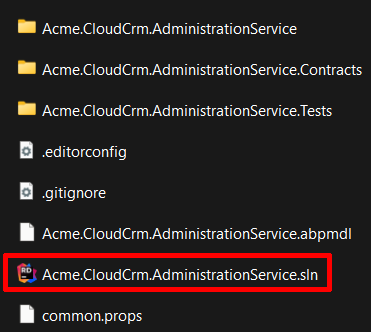
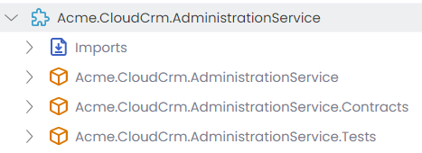
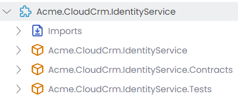
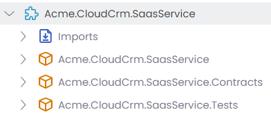
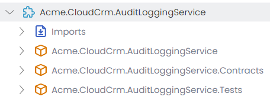
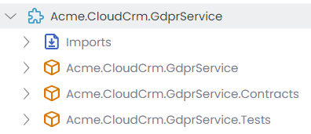

# Microservice Solution: The Microservices

The ABP Studio Microservice solution consists of a few microservices at the beginning. It is expected that you [add more microservices](guides/add-new-microservice.md) as your solution grows. This document briefly explains the structure of pre-built microservices in the solution.

The microservice count varies based on the options you've selected during the solution creation. However, the following microservices are always included:

* **Administration** microservice is used to manage permissions, languages and other fundamental settings of the system.
* **Identity** microservice is used to manage users, roles and their permissions. It basically serves to the [Identity](../../modules/identity.md) module's UI (and [OpenIddict](../../modules/openiddict.md) module's UI, if selected).

In the next section, you will learn the fundamental solution structure that is applied to all the microservices.

## Solution Structure of Microservices

All of the pre-built microservices are built with a common solution structure. This section explains that common solution structure and general decisions we've taken while designing that structure.

First of all, **every microservices has its own .NET solution**. In this way, you can independently develop, version, build and deploy it. You can even move a microservice to a different repository in your source control system since it has no dependency to other parts of the solution.

Microservice solutions are located under the `services` folder of the root solution folder. For example, if you open the `services/administration` folder, you will see the following folders and files:

Every microservice solution consists of three .NET projects. The following figure shows the Administration microservice in Visual Studio:

Let's explain the projects:

* `Acme.CloudCrm.AdministrationService` is the main executable application that hosts the microservice. It contains everything (entities, repositories, services, controllers, database configuration and migration, etc) related to that microservice.
* `Acme.CloudCrm.AdministrationService.Contracts` contains service interfaces and data transfer objects of your service. It is useful to separate contracts. In this way, you can share the *Contracts* package with the clients, so they can easily consume your services. See the [communication](communication.md) document to learn how to do it.
* `Acme.CloudCrm.AdministrationService.Tests` contains the unit and integration tests for that microservice. While it is highly suggested to build tests for your services, you can delete that project if you don't want to write tests.

> We haven't applied **layering** for the pre-built microservices, because they don't include much code and no need for such complexity. Microservices should be small (micro!) services, so you typically can manage your codebase in a single project/layer. However, if you want to implement layering for your microservices, you can create a layered microservice by following the *[Adding New Microservice](guides/add-new-microservice.md)* guide.

Next sections introduces and explains the pre-build services of the solution.

## Pre-Built Microservices

The solution structure of the services are common and already explained in the previous section. The following sections introduces the microservices and explains the fundamental unique points.

### Administration Microservice

The following figure shows the Administration microservice's module structure in ABP Studio's *Solution Explorer*:

Administration service is basically used to to manage **permissions** (using the [Permission Management](https://docs.abp.io/en/abp/latest/Modules/Permission-Management) module), **features** (using the [Feature Management](https://docs.abp.io/en/abp/latest/Modules/Feature-Management) module), **settings** (using the [Setting Management](https://docs.abp.io/en/abp/latest/Modules/Setting-Management) module) and **languages** (using the [Language Management](../../modules/language-management.md) module) (maybe some others based on your preferences) of the system. These are the common infrastructure services that are used by all the services and applications in the solution. Administration service is responsible to serve management HTTP APIs to UI for these services, and it also maintains the database schema for them.

In addition to these fundamental infrastructure services, Administration service also creates the [BLOB Storing database](https://docs.abp.io/en/abp/latest/Blob-Storing-Database), so other services can easily store BLOBs.

### Identity Microservice

The following figure shows the Identity microservice's module structure in ABP Studio's *Solution Explorer*:

Identity microservice is used by the UI to manage users, roles and their permissions. It uses the [Identity](../../modules/identity.md) module for that. If you've selected the OpenIddict UI while [creating your solution](../../get-started/microservice.md), it also serves the management API for OpenIddict. It created and manages the database schema for these modules.

### SaaS Microservice (optional)

If you've selected the [SaaS](../../modules/saas.md) module while [creating your solution](../../get-started/microservice.md), the Saas microservice is added to the solution as shown in the following figure:

This microservice serves the [SaaS](../../modules/saas.md) module's HTTP API, creates and manages its database.

> [Multi-Tenancy](https://docs.abp.io/en/abp/latest/Multi-Tenancy) is a common feature of the solution. If you install the SaaS module, multi-tenancy is automatically enabled for all the services and applications in the solution and the necessary configurations are done for you.

### Audit Logging Microservice (optional)

If you've selected the [Audit Logging](../../modules/audit-logging.md) module while [creating your solution](../../get-started/microservice.md), the Audit Logging microservice is added to the solution as shown in the following figure:

This microservice basically serves the [Audit Logging](../../modules/audit-logging.md) module's HTTP API, creates and manages its database.

### GDPR Microservice (optional)

If you've selected the [GDPR](../../modules/gdpr.md) module while [creating your solution](../../get-started/microservice.md), the Gdpr microservice is added to the solution as shown in the following figure:

This microservice basically serves the [GDPR](../../modules/gdpr.md) module's HTTP API, creates and manages its database.

Next

* [API Gateways in the Microservice solution](api-gateways.md)
