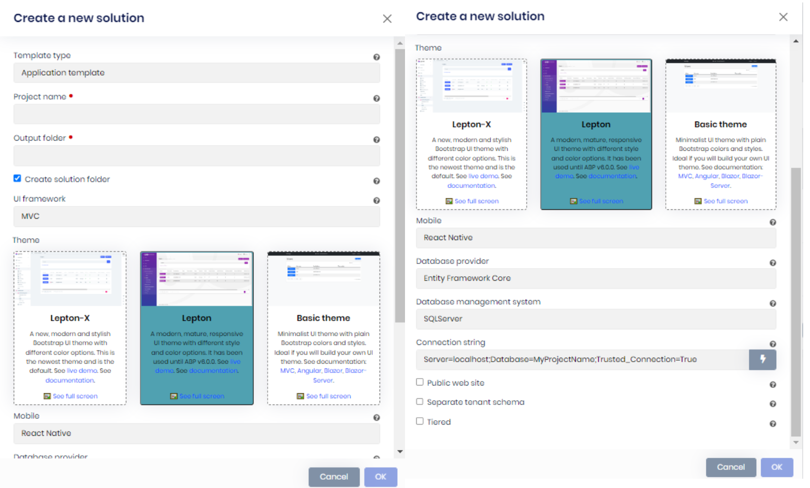
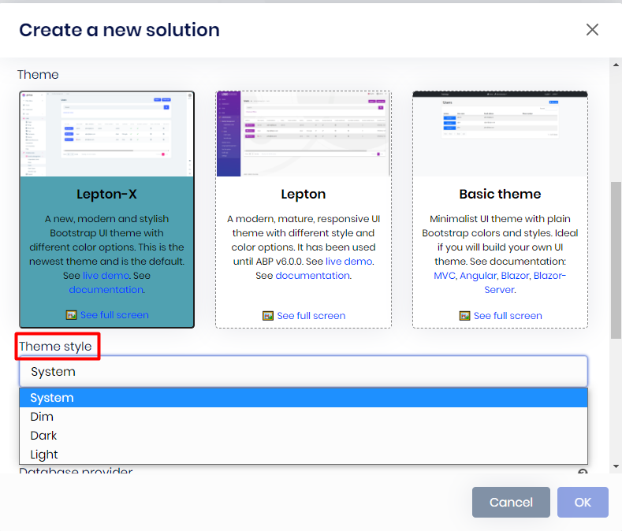

# Creating a new ABP solution

## Create a new solution

Creates a new ABP solution. It's an alternative way of creating an ABP project rather than [ABP CLI](../cli#new) or [abp.io](https://abp.io/get-started) website.  To create a new ABP Solution, click the **Create a new solution** button. It will open a new dialog for the options.

You need to provide your *template type*, *project name*, *output folder* where the project will be created in, *UI Framework* as your front-end, *mobile* option (**React Native** or **none**), *database provider*, *database management system* (if the database provider is **Entity Framework Core**) and *connection string*.

Also, you can add a *public web site* project to your solution, separate tenant schema by choosing the `Separated tenant schema` option and create the solution as tiered with the *Tiered* option which separates `Web` and `HTTP API` projects.

- **Template type:** This is the startup template type of your solution. You can check the all available templates from [here](../solution-templates).

- **Project name:** This is the solution name and also the prefix for the namespace of your solution. In this example `Acme.BookStore` is the project name. The solution file will be named as `Acme.BookStore.sln`. And the namespaces of `c#` files will start with `Acme.BookStore.*`

- **Output folder:** This is the directory where the new project will be created. Suite automatically creates the output directory if not exists and places the project folder inside the output directory. See the below folder view for `Acme.BookStore` project.

  

- **Theme:** You can generate your project with one of the 3 themes: `LeptonX`, `Lepton`, and `Basic theme`.

  - `LeptonX` is a new modern and stylish Bootstrap UI theme with different color options. It's is the newest theme and is the default.

  - `Lepton` is a modern, mature, responsive UI theme with different style and color options.

  - `Basic theme` is a minimalist UI theme with plain Bootstrap colors and styles. Ideal if you will build your own UI theme.

> If you choose **LeptonX**, another option named **Theme style** will show up, you can choose one out of 4 options: `System`, `Dim`, `Dark` or `Light`.

- **UI framework:** There are 4 types of UI Frameworks: `MVC`, `Angular`, `Blazor WebAssembly`, `Blazor Server`. Suite works with all of these frameworks.

  - If you choose `Angular` or `Blazor WebAssembly`, two checkbox options will appear at the bottom:

      - `Separate Auth Server`: Separates the Auth Server application from the API host application. If not checked, the server-side will have a single endpoint.

      - `Progressive web application`: Optional Progressive Web Application checkbox.

- **Mobile:** You can create the template with React Native and MAUI as a mobile framework or without any mobile application support.

- **Database Provider:** ABP framework supports 2 database providers: `Entity Framework Core` and `MongoDB`.  `Entity Framework Core` supports a variety of database management systems like `MS SQL Server`, `Oracle`, `MySQL` or  `PostgreSQL`. See the full list https://docs.microsoft.com/ef/core/providers/?tabs=dotnet-core-cli. On the other hand [MongoDB](https://www.mongodb.com/) is a document-oriented NoSQL database used for high volume data storage. If you have a requirement to work with relational database systems, choose  `Entity Framework Core` otherwise choose `MongoDB`.

- **Database management system:** You can choose your **Database Management System (DBMS)** while creating a new solution. There are 6 types of database management system: `SqlServer` (default), `MySQL`, `SQLite`, `Oracle`, `Oracle-Devart` and `PostgreSQL`.

- **Connection string:** You can define the connection string for connecting to the database by filling this area.

- **Public web site:** Creates the solution with an additional public web site project.

- **Separated tenant schema:** Creates the solution with the separated tenant schema support. Also, it creates a separate DbContext & migration path for tenants to not include host-related tables in tenant databases.

- **Tiered:** Creates a tiered solution where `Web` and `HTTP API ` layers are physically separated. If not specified, it creates a layered solution which is less complex and suitable for most scenarios. You can leave it unchecked, if you are not sure.

- **Preview:** Creates the solution in the latest preview version.

## What's next?

[Generating a CRUD page](generating-crud-page.md)
